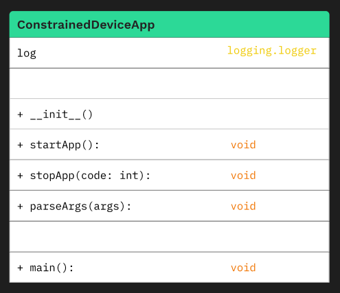

# Constrained Device Application (Connected Devices)

## Lab Module 01

Be sure to implement all the PIOT-CDA-* issues (requirements) listed at [PIOT-INF-01-001 - Lab Module 01](https://github.com/orgs/programming-the-iot/projects/1#column-9974937).

### Description

NOTE: Include two full paragraphs describing your implementation approach by answering the questions listed below.

What does your implementation do? 

The Constrained Device Application (CDA) function is used for simulating constrained devices at the edge layer of an IOT system The CDA simulates data, processes it locally, and distribute relevant information to higher-level devices or services as needed by the application. Simulating this functionality provides us with a controlled environment in which to test edge computing.

How does your implementation work?

The CDA is built using Python in a virtual environment, ensuring a clean and isolated development and testing process. It relies on Python libraries and modules that replicate the functionality of constrained devices, including local data processing, communication with the Gateway Device App (GDA) this gives us control in working with the CDA, adjusting its behavior, and monitoring its performance in a virtual environment, all to modify its behavior and to suit specific use cases.

### Code Repository and Branch

NOTE: Be sure to include the branch (e.g. https://github.com/programming-the-iot/python-components/tree/alpha001).

URL: https://github.com/dashIink/python-components

### UML Design Diagram(s)

NOTE: Include one or more UML designs representing your solution. It's expected each
diagram you provide will look similar to, but not the same as, its counterpart in the
book [Programming the IoT](https://learning.oreilly.com/library/view/programming-the-internet/9781492081401/).

### Unit Tests Executed

NOTE: TA's will execute your unit tests. You only need to list each test case below
(e.g. ConfigUtilTest, DataUtilTest, etc). Be sure to include all previous tests, too,
since you need to ensure you haven't introduced regressions.

- ConstrainedDeviceAppTest
- SystemPerformanceManagerTest

### Integration Tests Executed

NOTE: TA's will execute most of your integration tests using their own environment, with
some exceptions (such as your cloud connectivity tests). In such cases, they'll review
your code to ensure it's correct. As for the tests you execute, you only need to list each
test case below (e.g. SensorSimAdapterManagerTest, DeviceDataManagerTest, etc.)

- ConfigUtilTest
- SystemCpuUtilTaskTest
- SystemMemUtilTaskTest

EOF.
