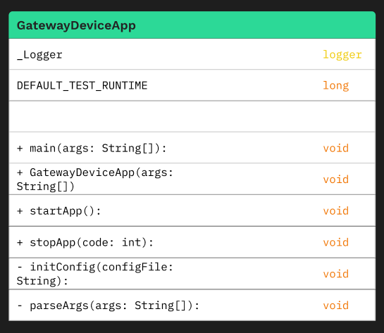

# Gateway Device Application (Connected Devices)

## Lab Module 01

Be sure to implement all the PIOT-GDA-* issues (requirements) listed at [PIOT-INF-01-001 - Lab Module 01](https://github.com/orgs/programming-the-iot/projects/1#column-9974937).

### Description

NOTE: Include two full paragraphs describing your implementation approach by answering the questions listed below.

What does your implementation do? 

The Gateway Device App (GDA) service is used to simulate a gateway device, which at the edge tier of networked systems a gateway device operates by collecting data from constrained devices, processing and integrating this data, and delivering it to higher-level (cloud) services. Using integrated simulated deployment allows us a simplified way of testing the behavior of gateway devices and their capabilities.

How does your implementation work?

The GDA is developed using the Java programming language and configured as an eclipse project, providing a development environment and Java application development tools. It also relies on Maven for managing dependencies. In the GDA's codebase Java libraries and frameworks are used to mimic gateway appliance functionality, including data processing, network connectivity, security, and data storage capabilities. It mimics gateway device behavior by receiving data from the Constrained Device Application (CDA).

### Code Repository and Branch

NOTE: Be sure to include the branch (e.g. https://github.com/programming-the-iot/python-components/tree/alpha001).

URL: https://github.com/lcbathtissue/java-components

### UML Design Diagram(s)

NOTE: Include one or more UML designs representing your solution. It's expected each
diagram you provide will look similar to, but not the same as, its counterpart in the
book [Programming the IoT](https://learning.oreilly.com/library/view/programming-the-internet/9781492081401/).

### Unit Tests Executed

NOTE: TA's will execute your unit tests. You only need to list each test case below
(e.g. ConfigUtilTest, DataUtilTest, etc). Be sure to include all previous tests, too,
since you need to ensure you haven't introduced regressions.

- GatewayDeviceAppTest
- SystemPerformanceManagerTest

### Integration Tests Executed

NOTE: TA's will execute most of your integration tests using their own environment, with
some exceptions (such as your cloud connectivity tests). In such cases, they'll review
your code to ensure it's correct. As for the tests you execute, you only need to list each
test case below (e.g. SensorSimAdapterManagerTest, DeviceDataManagerTest, etc.)

- ConfigUtilTest
- ResourceNameTest
- SystemCpuUtilTaskTest
- SystemMemUtilTaskTest

EOF.
