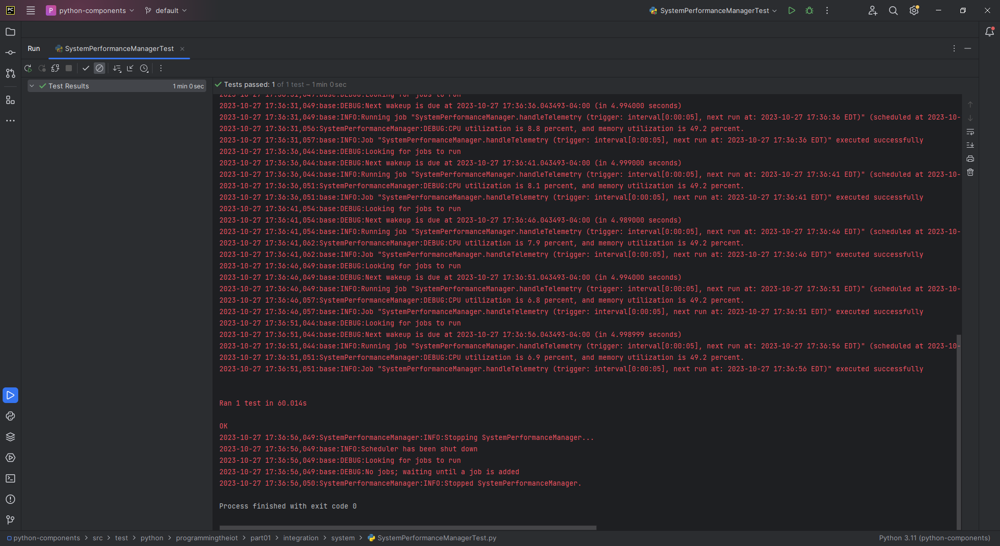
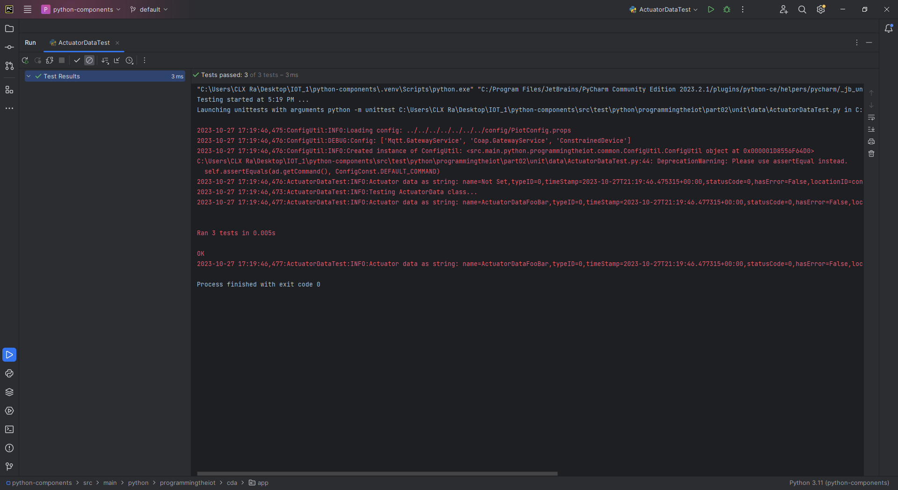
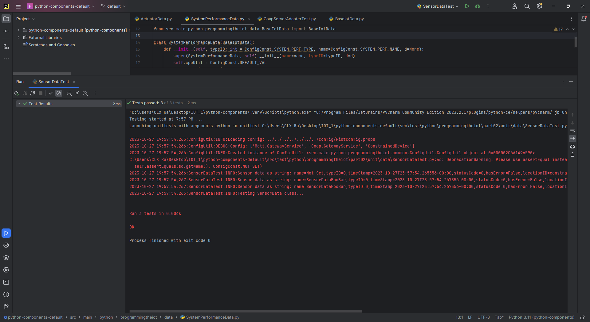
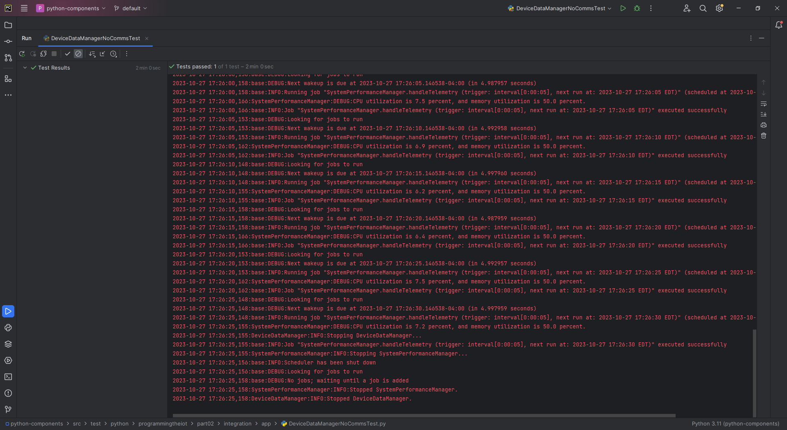
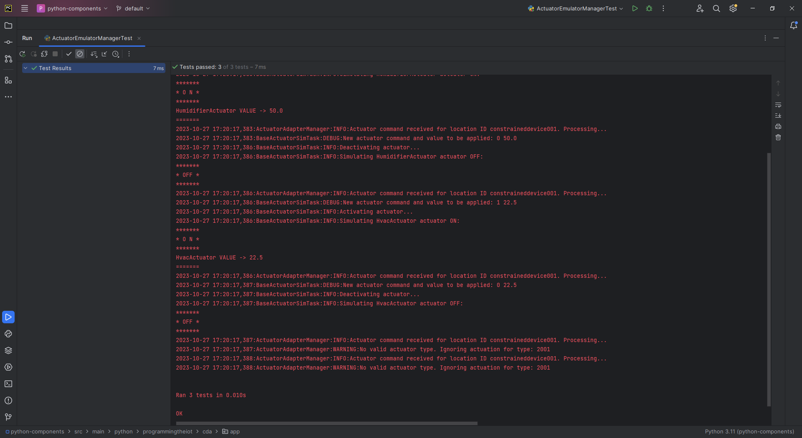
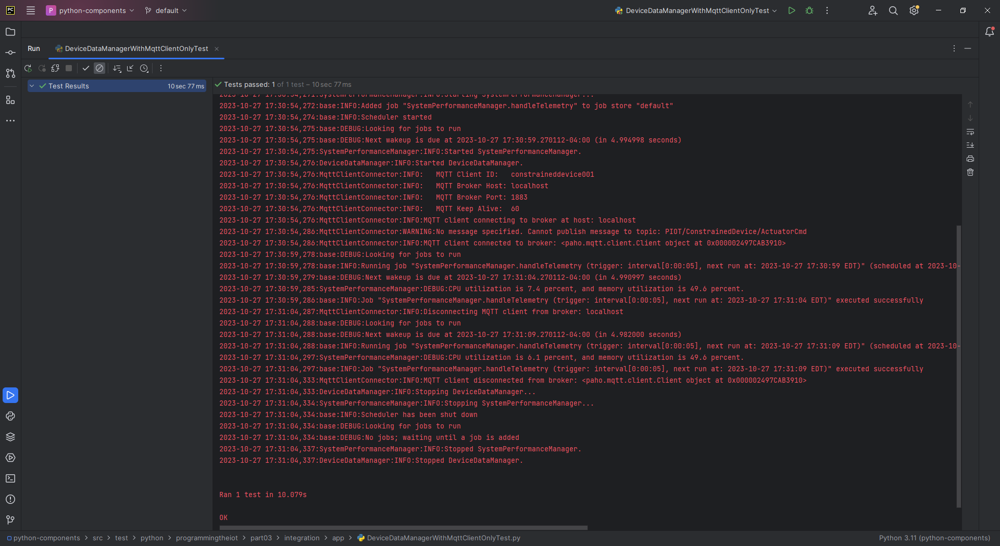
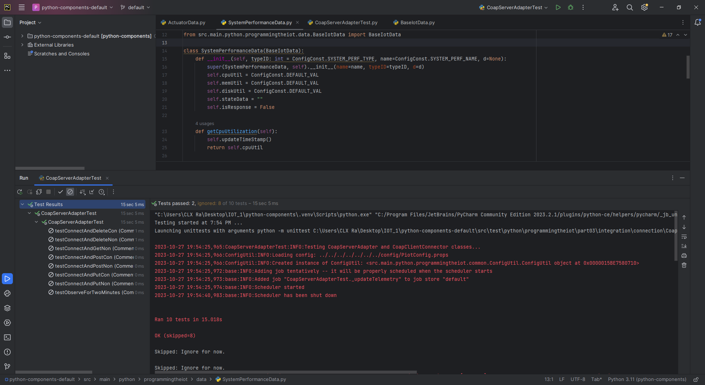

# Constrained Device Application (Connected Devices)

## Lab Module 02

Be sure to implement all the PIOT-CDA-* issues (requirements) listed at [PIOT-INF-02-001 - Lab Module 02](https://github.com/orgs/programming-the-iot/projects/1#column-9974938).

### Description

NOTE: Include two full paragraphs describing your implementation approach by answering the questions listed below.

What does your implementation do? 

The Constrained Device Application (CDA) now also integrates the system performance manager and system utility task modules to track and test the validity of the system's CPU and memory utilization while also logging the results to the terminal. 

How does your implementation work?

The CDA achieves this by using built in python modules such as Logger, ManagementFactory, MemoryUsage, etc for our classes in our program such as SystemCpuUtilTask & SystemMemUtilTask and pytest is used for automated testing of the software.

### Code Repository and Branch

NOTE: Be sure to include the branch (e.g. https://github.com/programming-the-iot/python-components/tree/alpha001).

URL: https://github.com/lcbathtissue/python-components

### UML Design Diagram(s)

NOTE: Include one or more UML designs representing your solution. It's expected each
diagram you provide will look similar to, but not the same as, its counterpart in the
book [Programming the IoT](https://learning.oreilly.com/library/view/programming-the-internet/9781492081401/).

### Unit Tests Executed

NOTE: TA's will execute your unit tests. You only need to list each test case below
(e.g. ConfigUtilTest, DataUtilTest, etc). Be sure to include all previous tests, too,
since you need to ensure you haven't introduced regressions.

- ConstrainedDeviceAppTest

- SystemPerformanceManagerTest

- ActuatorDataTest

- BaseIotDataTest

- DataUtilTest

- SensorDataTest

- SystemPerformanceDataTest

- HumidifierActuatorSimTaskTest

- HvacActuatorSimTaskTest

### Integration Tests Executed

NOTE: TA's will execute most of your integration tests using their own environment, with
some exceptions (such as your cloud connectivity tests). In such cases, they'll review
your code to ensure it's correct. As for the tests you execute, you only need to list each
test case below (e.g. SensorSimAdapterManagerTest, DeviceDataManagerTest, etc.)

- ConfigUtilTest

- SystemCpuUtilTaskTest

- SystemMemUtilTaskTest

- DeviceDataManagerNoCommsTest

- ActuatorEmulatorManagerTest

- HumidifierEmulatorTaskTest

The "fcntl" module used is built-in and only available on Unix-like operating systems.

- HumidityEmulatorTaskTest

The "fcntl" module used is built-in and only available on Unix-like operating systems.

- HvacEmulatorTaskTest

The "fcntl" module used is built-in and only available on Unix-like operating systems.

- LedDisplayEmulatorTaskTest

The "fcntl" module used is built-in and only available on Unix-like operating systems.

- PressureEmulatorTaskTest

The "fcntl" module used is built-in and only available on Unix-like operating systems.

- SenseHatEmulatorQuickTest

The "fcntl" module used is built-in and only available on Unix-like operating systems.

- SensorEmulatorManagerTest

- TemperatureEmulatorTaskTest

The "fcntl" module used is built-in and only available on Unix-like operating systems.

- DeviceDataManagerCallbackTest

- DeviceDataManagerIntegrationTest

- DeviceDataManagerWithCommsTest

- DeviceDataManagerWithMqttClientOnlyTest

- CoapClientConnectorTest

- CoapClientPerformanceTest

- CoapServerAdapterTest

- MqttClientConnectorTest

- MqttClientPerformanceTest

- ActuatorAdapterManagerTest

EOF.
