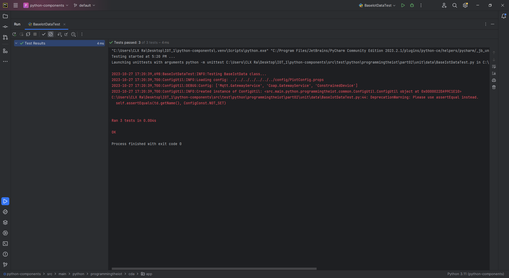
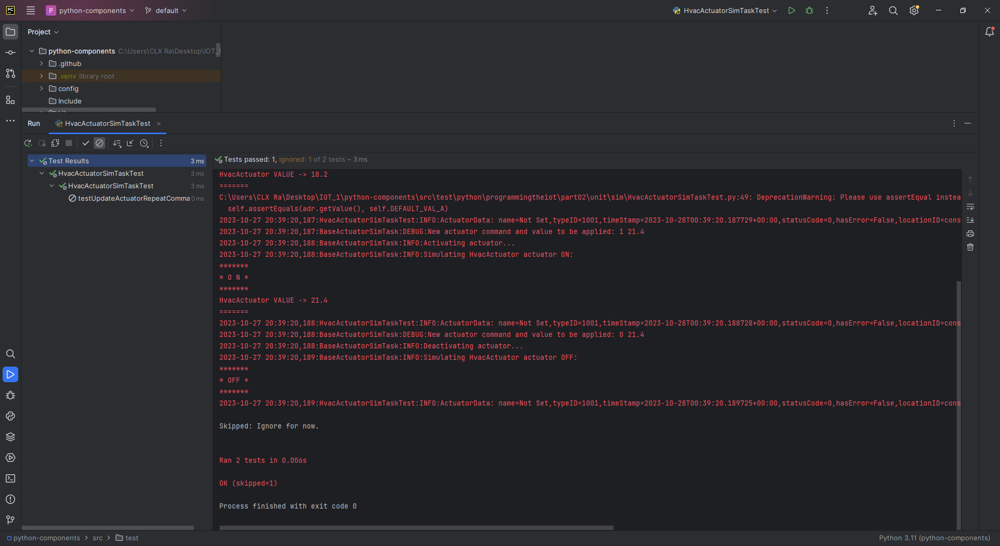
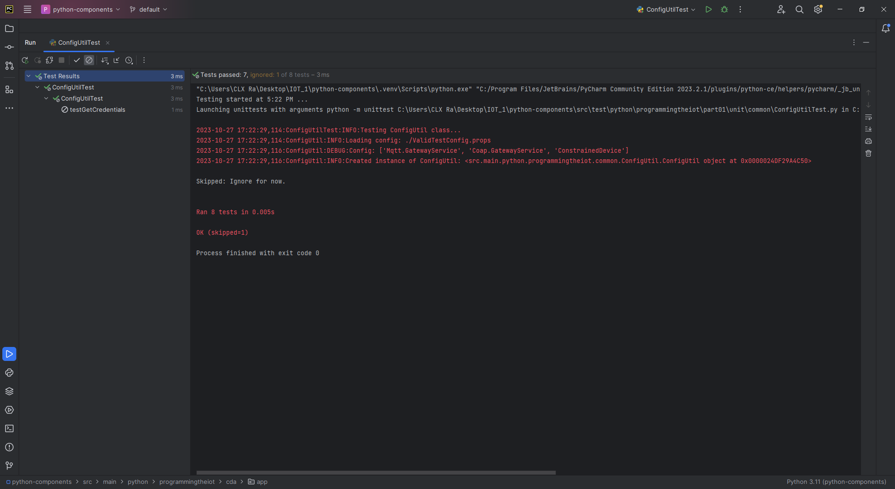
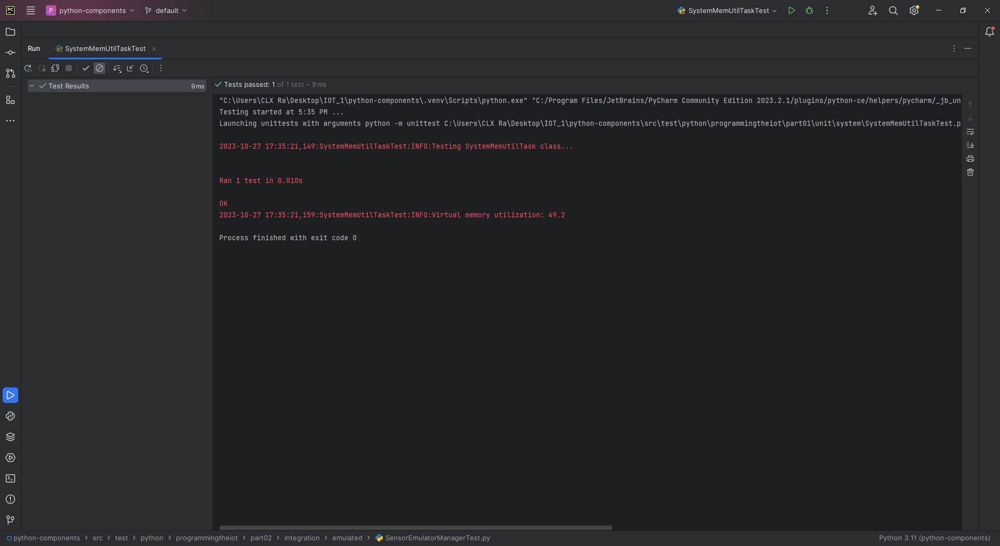
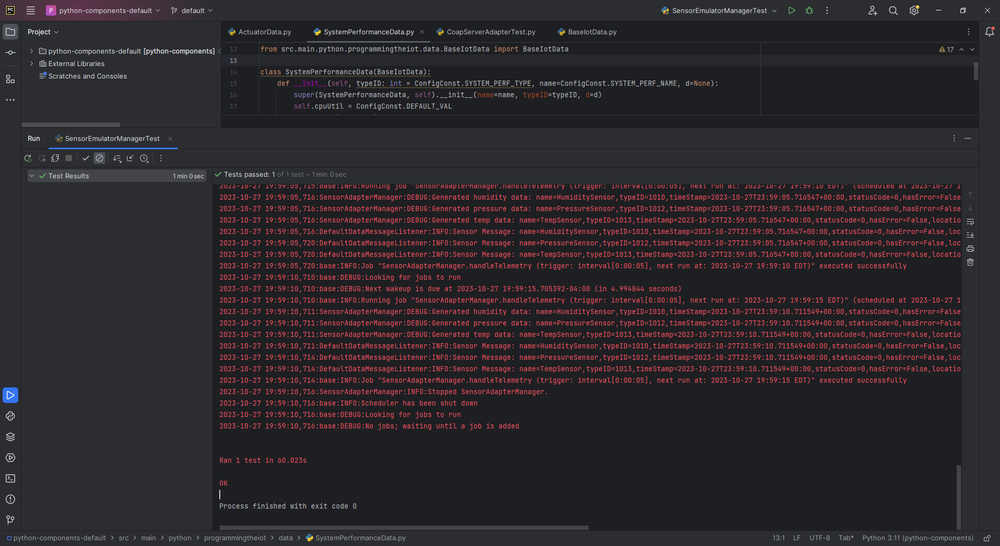
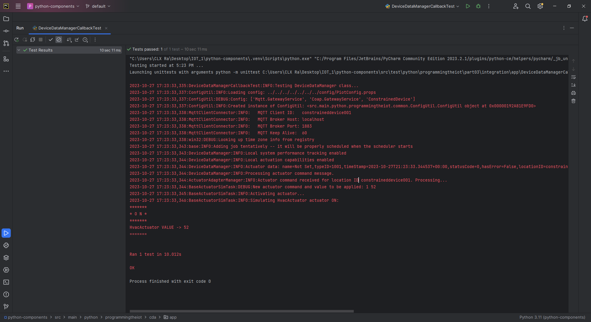
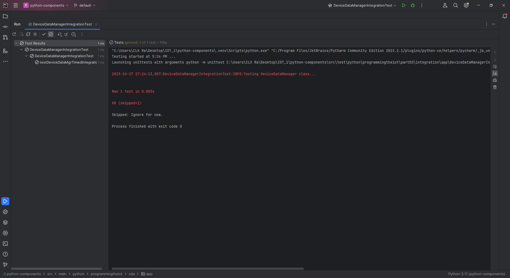

# Constrained Device Application (Connected Devices)

## Lab Module 03

Be sure to implement all the PIOT-CDA-* issues (requirements) listed at [PIOT-INF-03-001 - Lab Module 03](https://github.com/orgs/programming-the-iot/projects/1#column-10488379).

### Description

NOTE: Include two full paragraphs describing your implementation approach by answering the questions listed below.

What does your implementation do? 

Lab Module 03 improves the CDA by adding sensing and actuation for simulated humidity, pressure and temperature sensors. Simulated sensor dated mimics a real world environment through the encapsulating SimulatedSensor class, the data from the sensors is organized using TelemetryObjects which structure the data along with sensor information such as device ID's and timestamps. The ThresholdTrigger class monitors the sensor data to see if it has surpassed any limits and if so triggers specific actuators such as turning on a cooling or heating system. 

How does your implementation work?

The CDA creates instances of the SimulatedSensor class for each sensor, each with their own configuration and data simulation, these sensors periodically generate data which is packaged using the TelemetryObjects class along with additional information relating to the sensor/data. This data is sent to the ThresholdTrigger class which determines if an actuator should be used and if so the SimulatedActuator class simulates those actions. This system uses OOP design principles to make it modular and extensible.

### Code Repository and Branch

NOTE: Be sure to include the branch (e.g. https://github.com/programming-the-iot/python-components/tree/alpha001).

URL: https://github.com/lcbathtissue/python-components

### UML Design Diagram(s)

NOTE: Include one or more UML designs representing your solution. It's expected each
diagram you provide will look similar to, but not the same as, its counterpart in the
book [Programming the IoT](https://learning.oreilly.com/library/view/programming-the-internet/9781492081401/).

### Unit Tests Executed

NOTE: TA's will execute your unit tests. You only need to list each test case below
(e.g. ConfigUtilTest, DataUtilTest, etc). Be sure to include all previous tests, too,
since you need to ensure you haven't introduced regressions.

- ConstrainedDeviceAppTest

- SystemPerformanceManagerTest

- ActuatorDataTest

- BaseIotDataTest

- DataUtilTest

- SensorDataTest

- SystemPerformanceDataTest

- HumidifierActuatorSimTaskTest

- HvacActuatorSimTaskTest

### Integration Tests Executed

NOTE: TA's will execute most of your integration tests using their own environment, with
some exceptions (such as your cloud connectivity tests). In such cases, they'll review
your code to ensure it's correct. As for the tests you execute, you only need to list each
test case below (e.g. SensorSimAdapterManagerTest, DeviceDataManagerTest, etc.)

- ConfigUtilTest

- SystemCpuUtilTaskTest

- SystemMemUtilTaskTest

- DeviceDataManagerNoCommsTest

- ActuatorEmulatorManagerTest

- HumidifierEmulatorTaskTest

The "fcntl" module used is built-in and only available on Unix-like operating systems.

- HumidityEmulatorTaskTest

The "fcntl" module used is built-in and only available on Unix-like operating systems.

- HvacEmulatorTaskTest

The "fcntl" module used is built-in and only available on Unix-like operating systems.

- LedDisplayEmulatorTaskTest

The "fcntl" module used is built-in and only available on Unix-like operating systems.

- PressureEmulatorTaskTest

The "fcntl" module used is built-in and only available on Unix-like operating systems.

- SenseHatEmulatorQuickTest

The "fcntl" module used is built-in and only available on Unix-like operating systems.

- SensorEmulatorManagerTest

- TemperatureEmulatorTaskTest

The "fcntl" module used is built-in and only available on Unix-like operating systems.

- DeviceDataManagerCallbackTest

- DeviceDataManagerIntegrationTest

- DeviceDataManagerWithCommsTest

- DeviceDataManagerWithMqttClientOnlyTest

- CoapClientConnectorTest

- CoapClientPerformanceTest

- CoapServerAdapterTest

- MqttClientConnectorTest

- MqttClientPerformanceTest

- ActuatorAdapterManagerTest

EOF.
