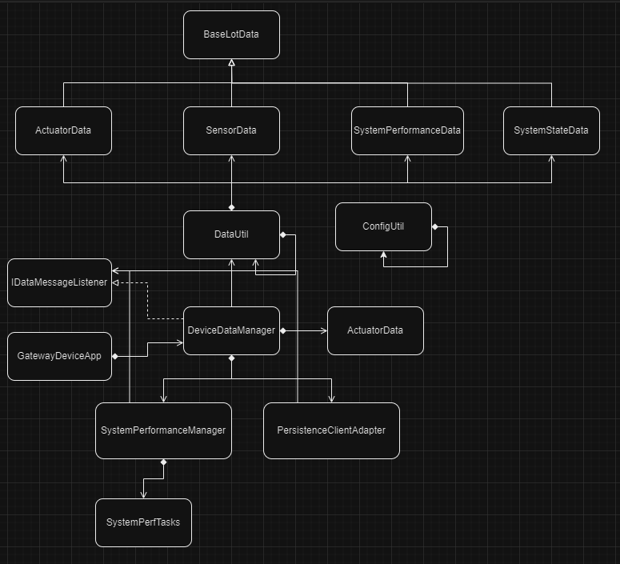
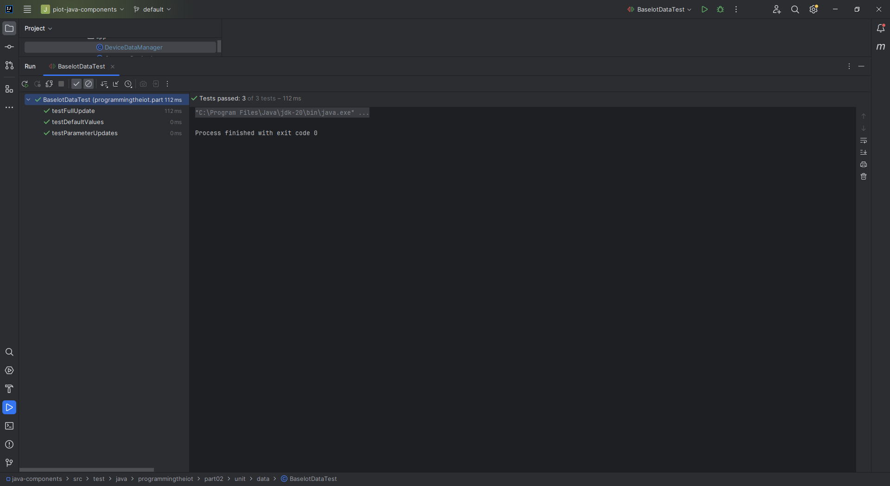
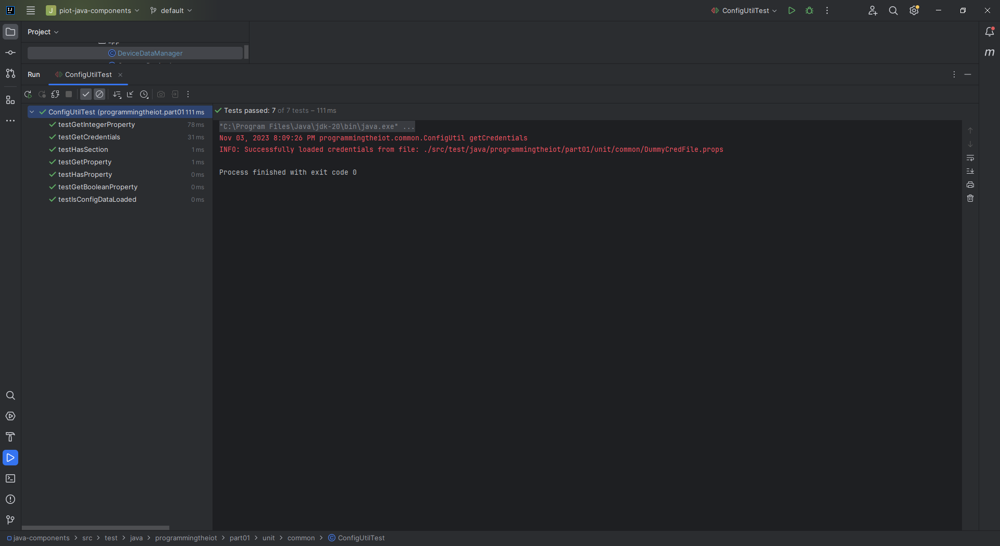
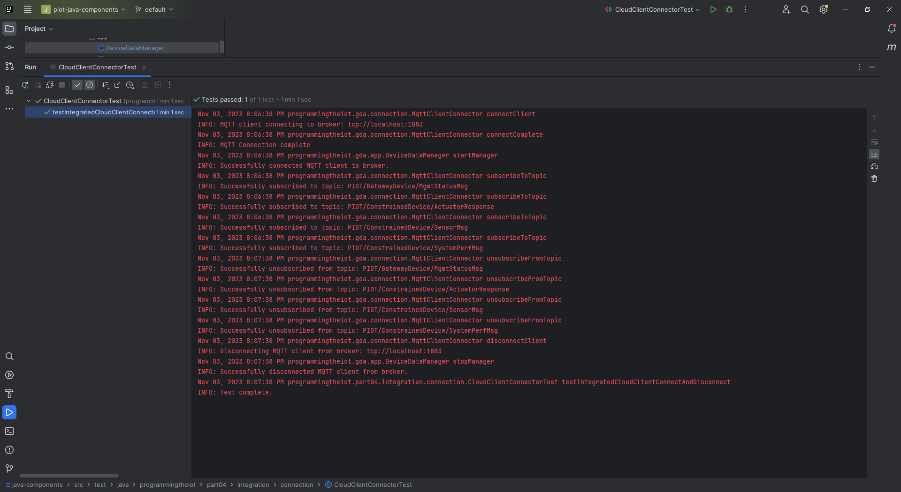
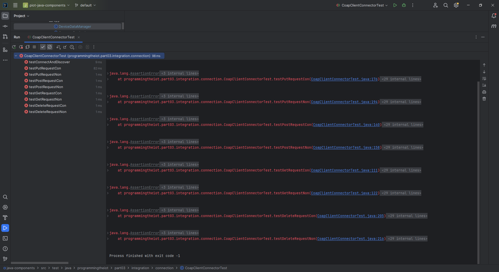
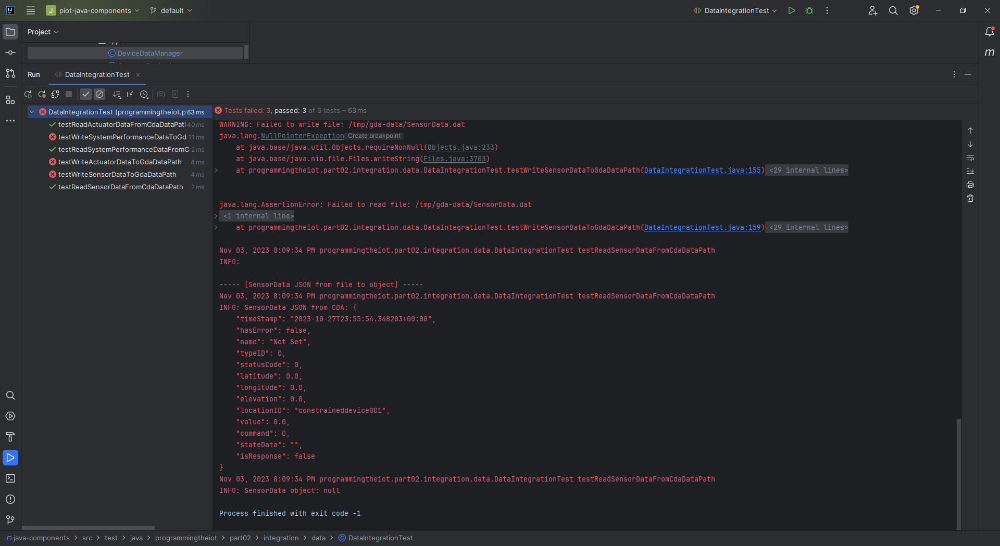
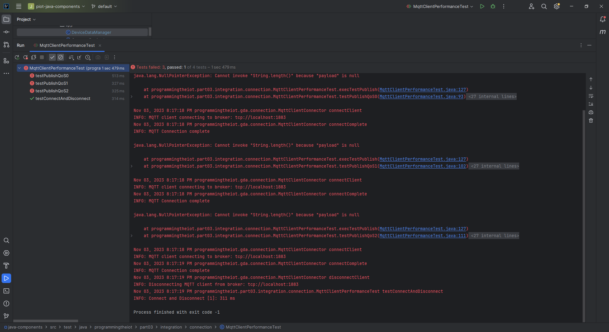

# Gateway Device Application (Connected Devices)

## Lab Module 02

Be sure to implement all the PIOT-GDA-* issues (requirements) listed at [PIOT-INF-02-001 - Lab Module 02](https://github.com/orgs/programming-the-iot/projects/1#column-9974938).

### Description

NOTE: Include two full paragraphs describing your implementation approach by answering the questions listed below.

What does your implementation do? 

The GDA (Gateway Device Application) implementation enhances the gateway device's capabilities by incorporating data management and transformation features. It receives data from the CDA and, with the newly added JSON-based object conversion functionality, can easily serialize and deserialize data wrappers to/from JSON. Additionally, it utilizes Redis, an object store, for local data storage. This means that the GDA can efficiently store and retrieve data locally, reducing the need for frequent external data retrieval, which can be resource-intensive in edge computing scenarios.

How does your implementation work?

The GDA, implemented in Java, receives data from the CDA. With the added JSON serialization and deserialization functionality, it can efficiently convert data wrappers into JSON format for processing and vice versa. This ensures that data received from the CDA can be transformed and processed seamlessly. Furthermore, the GDA leverages Redis as a local storage solution. This means that data can be persisted locally within Redis, providing fast access and reducing latency when accessing frequently used data. Overall, the GDA implementation enhances data management and transformation capabilities, ensuring efficient data exchange with the CDA and local storage for optimized edge-tier performance.

### Code Repository and Branch

NOTE: Be sure to include the branch (e.g. https://github.com/programming-the-iot/python-components/tree/alpha001).

URL: https://github.com/lcbathtissue/java-components

### UML Design Diagram(s)

NOTE: Include one or more UML designs representing your solution. It's expected each
diagram you provide will look similar to, but not the same as, its counterpart in the
book [Programming the IoT](https://learning.oreilly.com/library/view/programming-the-internet/9781492081401/).

### Unit Tests Executed

NOTE: TA's will execute your unit tests. You only need to list each test case below
(e.g. ConfigUtilTest, DataUtilTest, etc). Be sure to include all previous tests, too,
since you need to ensure you haven't introduced regressions.

- ActuatorDataTest

- BaseIotDataTest

- ConfigUtilTest

- DataUtilTest

- ResourceNameTest

- SensorDataTest

- SimpleCertManagementUtilTest

- SystemCpuUtilTaskTest

- SystemMemUtilTaskTest

- SystemPerformanceDataTest

### Integration Tests Executed

NOTE: TA's will execute most of your integration tests using their own environment, with
some exceptions (such as your cloud connectivity tests). In such cases, they'll review
your code to ensure it's correct. As for the tests you execute, you only need to list each
test case below (e.g. SensorSimAdapterManagerTest, DeviceDataManagerTest, etc.)

- CloudClientConnectorTest

- CoapClientConnectorTest

- CoapClientPerformanceTest

- CoapClientToServerConnectorTest

- CoapServerGatewayTest

- DataIntegrationTest

- DeviceDataManagerNoCommsTest

- DeviceDataManagerWithCommsTest

- GatewayDeviceAppTest

- MqttClientConnectorTest

- MqttClientControlPacketTest

- MqttClientPerformanceTest

- PersistenceClientAdapterTest

- SmtpClientConnectorTest

- SystemPerformanceManagerTest

EOF.