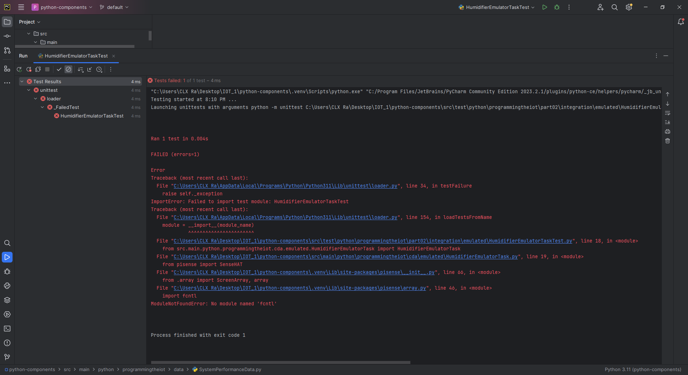
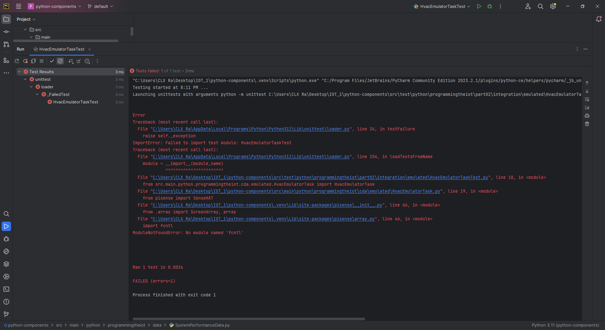
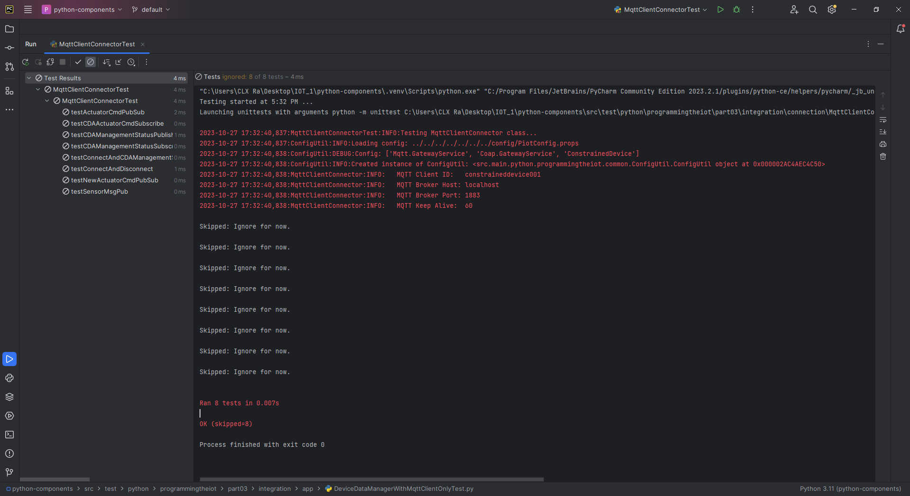

# Constrained Device Application (Connected Devices)

## Lab Module 06

Be sure to implement all the PIOT-CDA-* issues (requirements) listed at [PIOT-INF-06-001 - Lab Module 06](https://github.com/orgs/programming-the-iot/projects/1#column-10488434).

### Description

NOTE: Include two full paragraphs describing your implementation approach by answering the questions listed below.

What does your implementation do?

The CDA (Constrained Device Application) implementation focuses on simulating sensor data, packaging it, and enabling efficient data communication with the GDA (Gateway Device Application) using the Mosquitto MQTT broker. It simulates sensor readings for humidity, pressure, and temperature, packages this data into telemetry objects, and can trigger simulated actuation based on predefined thresholds. Additionally, it now incorporates JSON serialization capabilities to convert telemetry objects into JSON format for seamless data exchange with the GDA via the Mosquitto MQTT broker. This ensures that data generated by the CDA can be easily transformed and transmitted to the GDA for further processing using the MQTT protocol.

How does your implementation work?

The CDA uses Python and Object-Oriented design principles. Simulated sensors for humidity, pressure, and temperature generate synthetic sensor data periodically. TelemetryObjects are created to structure this data along with metadata like timestamps and device IDs. When threshold conditions are met, the CDA issues simulated actuator commands. The critical addition is the integration of the Mosquitto MQTT broker, which allows the CDA to publish telemetry data to specific MQTT topics. Subsequently, the GDA subscribes to these topics to receive the data. Additionally, the CDA incorporates JSON serialization functionality, which converts telemetry objects into JSON format and publishes them over MQTT. This enables the CDA to prepare its data for transmission to the GDA through the Mosquitto MQTT broker. By implementing JSON serialization and MQTT communication, the CDA ensures that its data can be efficiently shared with the GDA, facilitating data transformation and interoperability between the two components via the Mosquitto MQTT broker.

### Code Repository and Branch

NOTE: Be sure to include the branch (e.g. https://github.com/programming-the-iot/python-components/tree/alpha001).

URL: https://github.com/lcbathtissue/python-components/tree/labmodule06

### UML Design Diagram(s)

NOTE: Include one or more UML designs representing your solution. It's expected each
diagram you provide will look similar to, but not the same as, its counterpart in the
book [Programming the IoT](https://learning.oreilly.com/library/view/programming-the-internet/9781492081401/).

### Unit Tests Executed

NOTE: TA's will execute your unit tests. You only need to list each test case below
(e.g. ConfigUtilTest, DataUtilTest, etc). Be sure to include all previous tests, too,
since you need to ensure you haven't introduced regressions.

- ConstrainedDeviceAppTest

- SystemPerformanceManagerTest

- ActuatorDataTest

- BaseIotDataTest

- DataUtilTest

- SensorDataTest

- SystemPerformanceDataTest

- HumidifierActuatorSimTaskTest

- HvacActuatorSimTaskTest

### Integration Tests Executed

NOTE: TA's will execute most of your integration tests using their own environment, with
some exceptions (such as your cloud connectivity tests). In such cases, they'll review
your code to ensure it's correct. As for the tests you execute, you only need to list each
test case below (e.g. SensorSimAdapterManagerTest, DeviceDataManagerTest, etc.)

- ConfigUtilTest

- SystemCpuUtilTaskTest

- SystemMemUtilTaskTest

- DeviceDataManagerNoCommsTest

- ActuatorEmulatorManagerTest

- HumidifierEmulatorTaskTest

The "fcntl" module used is built-in and only available on Unix-like operating systems.

- HumidityEmulatorTaskTest

The "fcntl" module used is built-in and only available on Unix-like operating systems.

- HvacEmulatorTaskTest

The "fcntl" module used is built-in and only available on Unix-like operating systems.

- LedDisplayEmulatorTaskTest

The "fcntl" module used is built-in and only available on Unix-like operating systems.

- PressureEmulatorTaskTest

The "fcntl" module used is built-in and only available on Unix-like operating systems.

- SenseHatEmulatorQuickTest

The "fcntl" module used is built-in and only available on Unix-like operating systems.

- SensorEmulatorManagerTest

- TemperatureEmulatorTaskTest

The "fcntl" module used is built-in and only available on Unix-like operating systems.

- DeviceDataManagerCallbackTest

- DeviceDataManagerIntegrationTest

- DeviceDataManagerWithCommsTest

- DeviceDataManagerWithMqttClientOnlyTest

- CoapClientConnectorTest

- CoapClientPerformanceTest

- CoapServerAdapterTest

- MqttClientConnectorTest

- MqttClientPerformanceTest

- ActuatorAdapterManagerTest

EOF.
