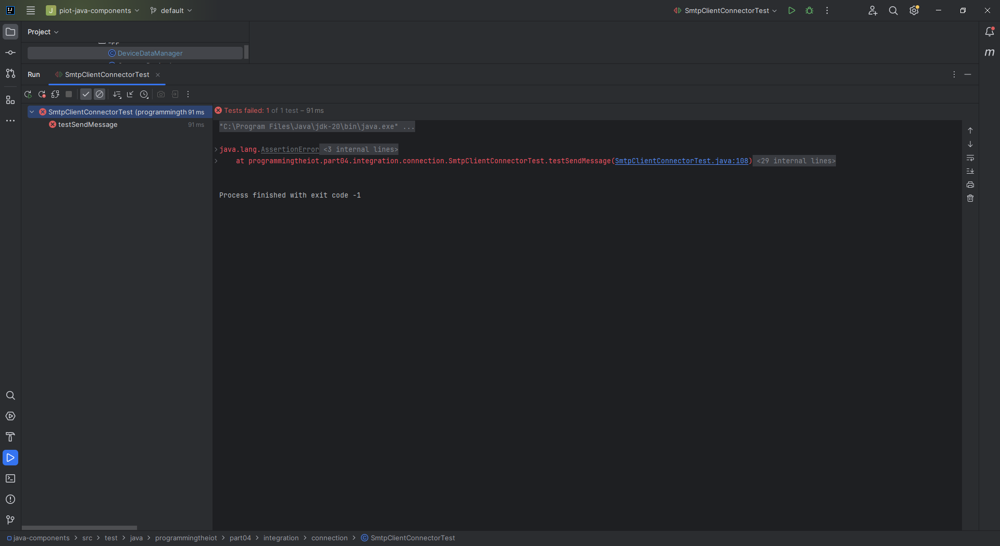

# Gateway Device Application (Connected Devices)

## Lab Module 07

Be sure to implement all the PIOT-GDA-* issues (requirements) listed at [PIOT-INF-07-001 - Lab Module 07](https://github.com/orgs/programming-the-iot/projects/1#column-10488499).

### Description

NOTE: Include two full paragraphs describing your implementation approach by answering the questions listed below.

What does your implementation do? 

The GDA (Gateway Device Application) implementation has been updated to incorporate the Mosquitto MQTT broker for enhanced data management and transformation features. It now receives data from the CDA and utilizes the Mosquitto MQTT broker for efficient data communication. With the newly added JSON-based object conversion functionality, it can serialize and deserialize data wrappers to/from JSON and publish/subscribe to topics using the MQTT protocol. Additionally, it continues to use Redis as an object store for local data storage, ensuring efficient data retrieval and reducing the need for frequent external data requests in edge computing scenarios.

How does your implementation work?

The GDA, implemented in Java, receives data from the CDA via the Mosquitto MQTT broker. It uses the added JSON serialization and deserialization functionality to efficiently convert data wrappers into JSON format for processing and vice versa. The GDA can now publish data to MQTT topics and subscribe to specific topics to receive data, facilitating seamless data exchange with the CDA over MQTT. It also leverages Redis as a local storage solution for persisting data, ensuring fast access and reduced latency when accessing frequently used data. Overall, the updated GDA implementation enhances data management and transformation capabilities, allowing efficient data exchange with the CDA using MQTT and providing local storage for optimized edge-tier performance.

### Code Repository and Branch

NOTE: Be sure to include the branch (e.g. https://github.com/programming-the-iot/python-components/tree/alpha001).

URL: https://github.com/lcbathtissue/java-components

### UML Design Diagram(s)

NOTE: Include one or more UML designs representing your solution. It's expected each
diagram you provide will look similar to, but not the same as, its counterpart in the
book [Programming the IoT](https://learning.oreilly.com/library/view/programming-the-internet/9781492081401/).

### Unit Tests Executed

NOTE: TA's will execute your unit tests. You only need to list each test case below
(e.g. ConfigUtilTest, DataUtilTest, etc). Be sure to include all previous tests, too,
since you need to ensure you haven't introduced regressions.

- ActuatorDataTest

- BaseIotDataTest

- ConfigUtilTest

- DataUtilTest

- ResourceNameTest

- SensorDataTest

- SimpleCertManagementUtilTest

- SystemCpuUtilTaskTest

- SystemMemUtilTaskTest

- SystemPerformanceDataTest

### Integration Tests Executed

NOTE: TA's will execute most of your integration tests using their own environment, with
some exceptions (such as your cloud connectivity tests). In such cases, they'll review
your code to ensure it's correct. As for the tests you execute, you only need to list each
test case below (e.g. SensorSimAdapterManagerTest, DeviceDataManagerTest, etc.)

- CloudClientConnectorTest

- CoapClientConnectorTest

- CoapClientPerformanceTest

- CoapClientToServerConnectorTest

- CoapServerGatewayTest

- DataIntegrationTest

- DeviceDataManagerNoCommsTest

- DeviceDataManagerWithCommsTest

- GatewayDeviceAppTest

- MqttClientConnectorTest

- MqttClientControlPacketTest

- MqttClientPerformanceTest

- PersistenceClientAdapterTest

- SmtpClientConnectorTest

- SystemPerformanceManagerTest

EOF.
