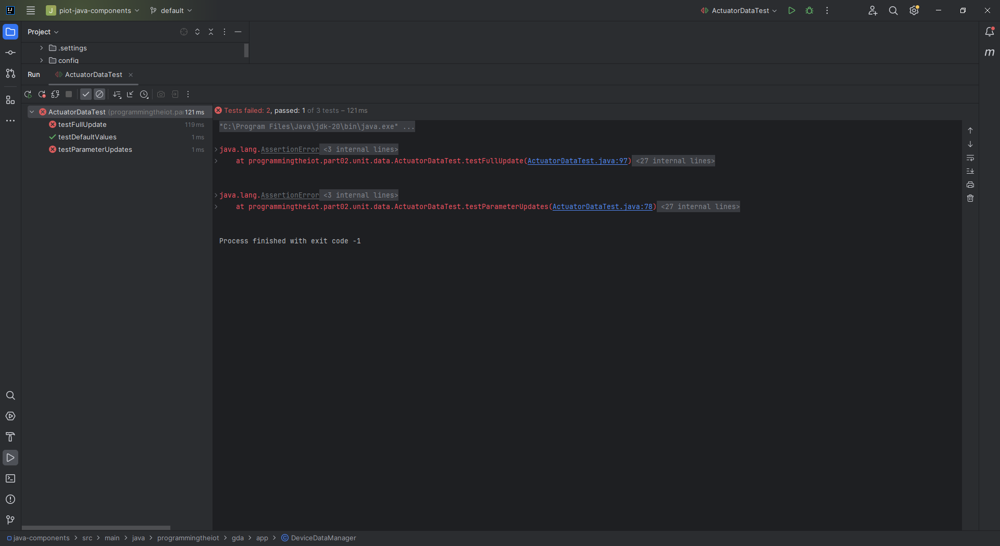
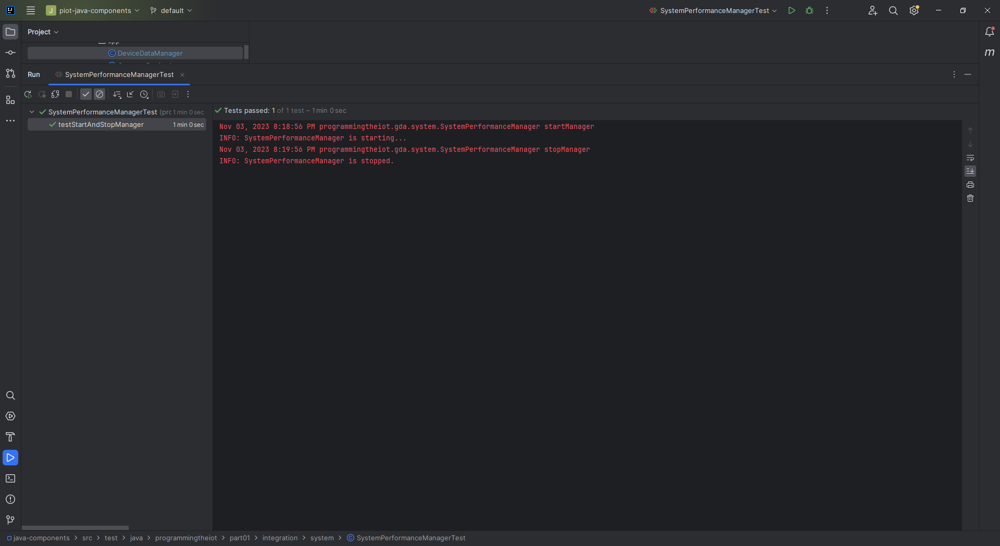

# Gateway Device Application (Connected Devices)

## Lab Module 08

Be sure to implement all the PIOT-GDA-* issues (requirements) listed at [PIOT-INF-08-001 - Lab Module 08](https://github.com/orgs/programming-the-iot/projects/1#column-10488501).

### Description

NOTE: Include two full paragraphs describing your implementation approach by answering the questions listed below.

What does your updated implementation do?

The GDA now is ready to communicate with the CDA using both the Mosquitto MQTT broker and the CoAP server based on the Californium framework. This dual-protocol support allows for flexibility in data exchange, accommodating different communication preferences and requirements. The GDA can receive data from the CDA via either MQTT or CoAP, ensuring compatibility with a diverse range of devices and systems.

How does your updated implementation work?

The GDA, can receive data from the CDA through either the Mosquitto MQTT broker or the CoAP server. With the existing JSON serialization and deserialization functionality, it efficiently converts data wrappers into JSON format for processing and vice versa. The GDA can publish data to MQTT topics, subscribe to specific MQTT topics, and handle CoAP requests and responses. This dual-protocol capability facilitates seamless data exchange with the CDA, supporting both MQTT and CoAP communication.

In addition to the dual-protocol support, the GDA continues to use Redis as an object store for local data storage. This ensures efficient data retrieval, whether received via MQTT or CoAP, and reduces the need for frequent external data requests in edge computing scenarios. Overall, the updated GDA implementation offers a versatile solution for data management and transformation, allowing efficient communication with the CDA using both MQTT and CoAP, and providing local storage for optimized edge-tier performance.

### Code Repository and Branch

NOTE: Be sure to include the branch (e.g. https://github.com/programming-the-iot/python-components/tree/alpha001).

URL: https://github.com/lcbathtissue/java-components

### UML Design Diagram(s)

NOTE: Include one or more UML designs representing your solution. It's expected each
diagram you provide will look similar to, but not the same as, its counterpart in the
book [Programming the IoT](https://learning.oreilly.com/library/view/programming-the-internet/9781492081401/).

### Unit Tests Executed

NOTE: TA's will execute your unit tests. You only need to list each test case below
(e.g. ConfigUtilTest, DataUtilTest, etc). Be sure to include all previous tests, too,
since you need to ensure you haven't introduced regressions.

- ActuatorDataTest

- BaseIotDataTest

- ConfigUtilTest

- DataUtilTest

- ResourceNameTest

- SensorDataTest

- SimpleCertManagementUtilTest

- SystemCpuUtilTaskTest

- SystemMemUtilTaskTest

- SystemPerformanceDataTest

### Integration Tests Executed

NOTE: TA's will execute most of your integration tests using their own environment, with
some exceptions (such as your cloud connectivity tests). In such cases, they'll review
your code to ensure it's correct. As for the tests you execute, you only need to list each
test case below (e.g. SensorSimAdapterManagerTest, DeviceDataManagerTest, etc.)

- CloudClientConnectorTest

- CoapClientConnectorTest

- CoapClientPerformanceTest

- CoapClientToServerConnectorTest

- CoapServerGatewayTest

- DataIntegrationTest

- DeviceDataManagerNoCommsTest

- DeviceDataManagerWithCommsTest

- GatewayDeviceAppTest

- MqttClientConnectorTest

- MqttClientControlPacketTest

- MqttClientPerformanceTest

- PersistenceClientAdapterTest

- SmtpClientConnectorTest

- SystemPerformanceManagerTest

EOF.
