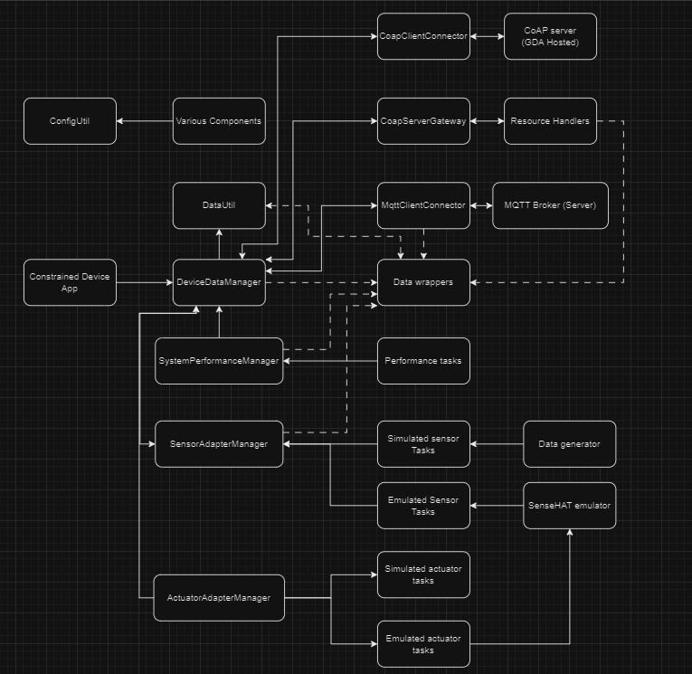
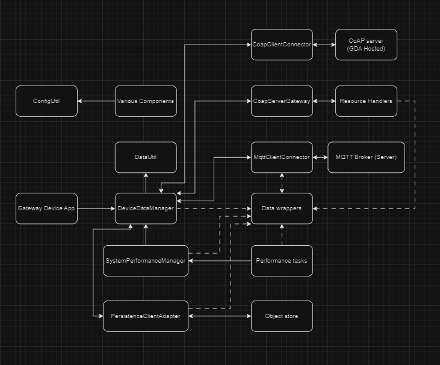
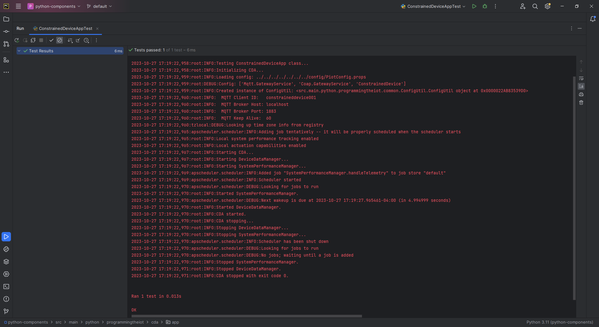
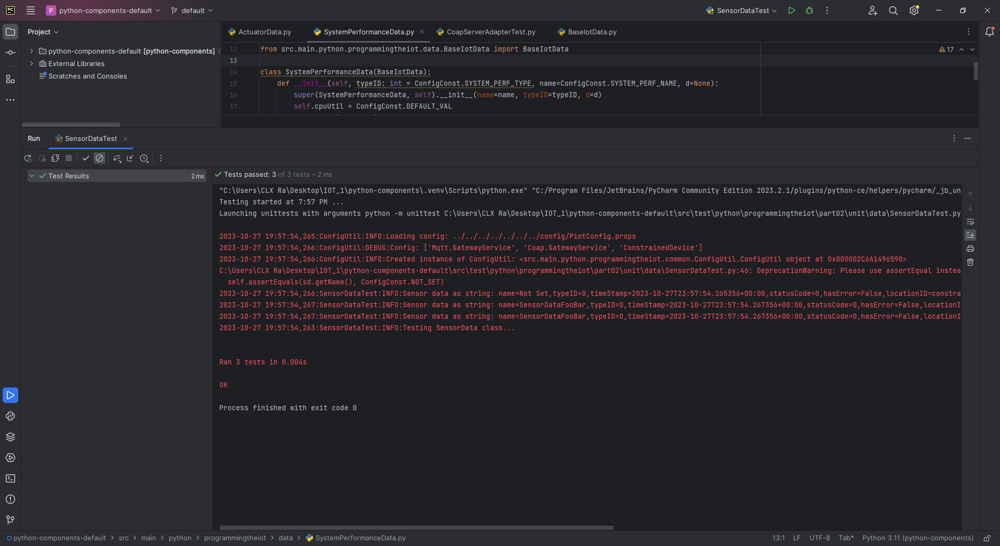
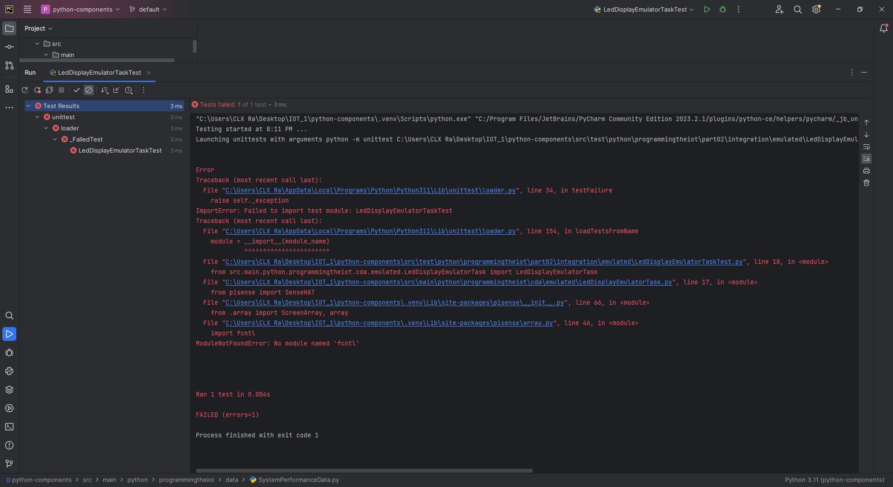
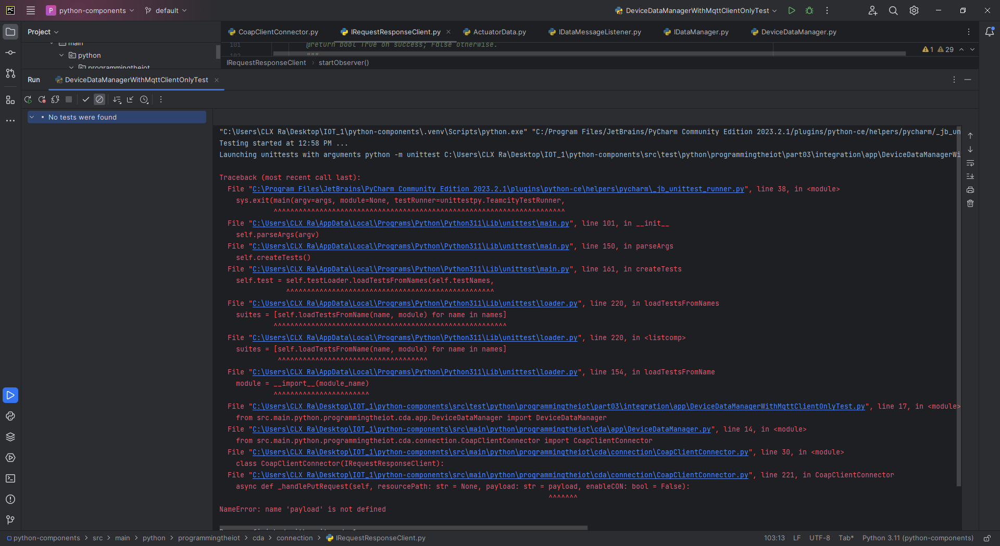

# Constrained Device Application (Connected Devices)

## Lab Module 09

Be sure to implement all the PIOT-CDA-* issues (requirements) listed at [PIOT-INF-09-001 - Lab Module 09](https://github.com/orgs/programming-the-iot/projects/1#column-10488503).

### Description

NOTE: Include two full paragraphs describing your implementation approach by answering the questions listed below.

What does your implementation do?

The CDA (Constrained Device Application) implementation focuses on simulating sensor data, packaging it, and enabling efficient data communication with the GDA (Gateway Device Application) using a CoAP-based client for CoAP communication. It simulates sensor readings for humidity, pressure, and temperature, packages this data into telemetry objects, and can trigger simulated actuation based on predefined thresholds. Additionally, it incorporates JSON serialization capabilities to convert telemetry objects into JSON format for seamless data exchange with the GDA via the CoAP-based client. This ensures that data generated by the CDA can be easily transformed and transmitted to the GDA for further processing using the CoAP protocol.

How does your implementation work?

The CDA utilizes Python and Object-Oriented design principles. Simulated sensors for humidity, pressure, and temperature generate synthetic sensor data periodically. TelemetryObjects are created to structure this data along with metadata like timestamps and device IDs. When threshold conditions are met, the CDA issues simulated actuator commands. The critical addition is the integration of a CoAP-based client, allowing the CDA to communicate with the GDA's CoAP server. Through this client, the CDA sends CoAP requests containing the telemetry data formatted as JSON payloads. The GDA, acting as a CoAP server, receives these requests and processes the JSON data sent by the CDA. By implementing CoAP-based communication and JSON serialization, the CDA ensures efficient data exchange with the GDA, promoting interoperability and facilitating data transformation between the two components via the CoAP protocol.

### Code Repository and Branch

NOTE: Be sure to include the branch (e.g. https://github.com/programming-the-iot/python-components/tree/alpha001).

URL: https://github.com/lcbathtissue/python-components/tree/labmodule09

### UML Design Diagram(s)

NOTE: Include one or more UML designs representing your solution. It's expected each
diagram you provide will look similar to, but not the same as, its counterpart in the
book [Programming the IoT](https://learning.oreilly.com/library/view/programming-the-internet/9781492081401/).

### Unit Tests Executed

NOTE: TA's will execute your unit tests. You only need to list each test case below
(e.g. ConfigUtilTest, DataUtilTest, etc). Be sure to include all previous tests, too,
since you need to ensure you haven't introduced regressions.

- ConstrainedDeviceAppTest

- SystemPerformanceManagerTest

- ActuatorDataTest

- BaseIotDataTest

- DataUtilTest

- SensorDataTest

- SystemPerformanceDataTest

- HumidifierActuatorSimTaskTest

- HvacActuatorSimTaskTest

### Integration Tests Executed

NOTE: TA's will execute most of your integration tests using their own environment, with
some exceptions (such as your cloud connectivity tests). In such cases, they'll review
your code to ensure it's correct. As for the tests you execute, you only need to list each
test case below (e.g. SensorSimAdapterManagerTest, DeviceDataManagerTest, etc.)

- ConfigUtilTest

- SystemCpuUtilTaskTest

- SystemMemUtilTaskTest

- DeviceDataManagerNoCommsTest

- ActuatorEmulatorManagerTest

- HumidifierEmulatorTaskTest

The "fcntl" module used is built-in and only available on Unix-like operating systems.

- HumidityEmulatorTaskTest

The "fcntl" module used is built-in and only available on Unix-like operating systems.

- HvacEmulatorTaskTest

The "fcntl" module used is built-in and only available on Unix-like operating systems.

- LedDisplayEmulatorTaskTest

The "fcntl" module used is built-in and only available on Unix-like operating systems.

- PressureEmulatorTaskTest

The "fcntl" module used is built-in and only available on Unix-like operating systems.

- SenseHatEmulatorQuickTest

The "fcntl" module used is built-in and only available on Unix-like operating systems.

- SensorEmulatorManagerTest

- TemperatureEmulatorTaskTest

The "fcntl" module used is built-in and only available on Unix-like operating systems.

- DeviceDataManagerCallbackTest

- DeviceDataManagerIntegrationTest

- DeviceDataManagerWithCommsTest

- DeviceDataManagerWithMqttClientOnlyTest

- CoapClientConnectorTest

- CoapClientPerformanceTest

- CoapServerAdapterTest

- MqttClientConnectorTest

- MqttClientPerformanceTest

- ActuatorAdapterManagerTest

EOF.
