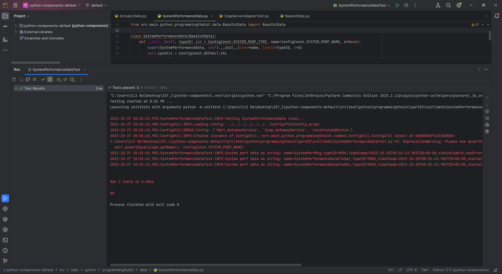
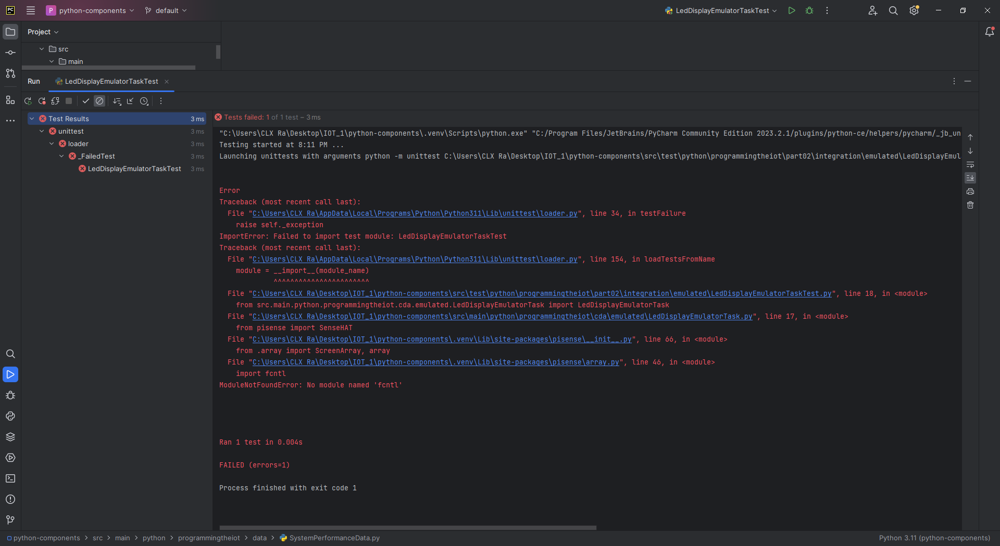
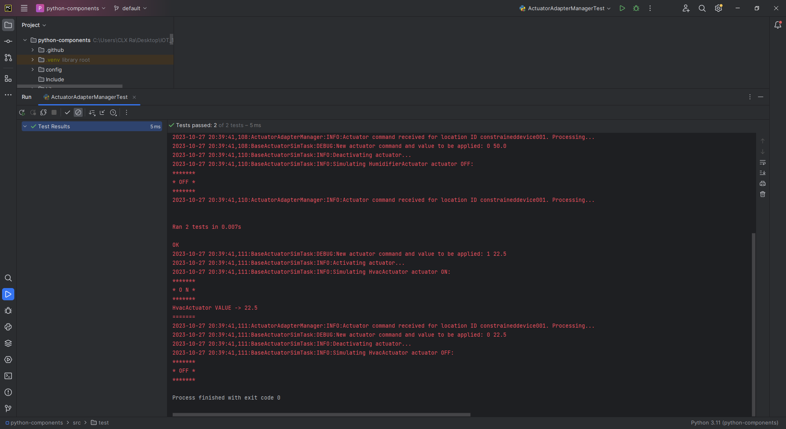

# Constrained Device Application (Connected Devices)

## Lab Module 10

Be sure to implement all the PIOT-CDA-* issues (requirements) listed at [PIOT-INF-10-001 - Lab Module 10](https://github.com/orgs/programming-the-iot/projects/1#column-10488510).

### Description

NOTE: Include two full paragraphs describing your implementation approach by answering the questions listed below.

What does your implementation do?

The CDA (Constrained Device Application) implementation focuses on simulating sensor data, packaging it, and enabling efficient data communication with the GDA (Gateway Device Application) using a CoAP-based client for CoAP communication. It simulates sensor readings for humidity, pressure, and temperature, packages this data into telemetry objects, and can trigger simulated actuation based on predefined thresholds. Moreover, the CDA incorporates edge messaging using MQTT for handling various messaging scenarios between the GDA and CDA. It uses MQTT to process sensor messages within the CDA, specifically to detect temperature crossing thresholds and trigger actuation events for temperature adjustments. The CDA actively tracks temperature breaches and initiates corrective actions. Additionally, it integrates JSON serialization capabilities to convert telemetry objects into JSON format for seamless data exchange with the GDA via the CoAP-based client. This ensures that data generated by the CDA, especially concerning temperature thresholds and actuation triggers, can be efficiently transformed and transmitted to the GDA for further processing using the CoAP protocol.

How does your implementation work?

The CDA employs Python and adheres to Object-Oriented design principles. Simulated sensors for humidity, pressure, and temperature generate synthetic sensor data periodically. TelemetryObjects are structured to encapsulate this data alongside metadata such as timestamps and device IDs. When threshold conditions, particularly those related to temperature, are crossed, the CDA issues MQTT messages to trigger actuation logic for temperature adjustment. The critical addition of edge messaging using MQTT enables the CDA to handle messaging scenarios involving temperature thresholds and actuation triggers internally. This allows the CDA to independently manage and process these events without relying solely on communication with the GDA. Concurrently, the CoAP-based client facilitates communication with the GDA for broader data exchange and interoperability, ensuring that critical data, especially temperature-related events, can be shared efficiently and effectively between the CDA and GDA.

### Code Repository and Branch

NOTE: Be sure to include the branch (e.g. https://github.com/programming-the-iot/python-components/tree/alpha001).

URL:  https://github.com/lcbathtissue/python-components/

### UML Design Diagram(s)

NOTE: Include one or more UML designs representing your solution. It's expected each
diagram you provide will look similar to, but not the same as, its counterpart in the
book [Programming the IoT](https://learning.oreilly.com/library/view/programming-the-internet/9781492081401/).

### Unit Tests Executed

NOTE: TA's will execute your unit tests. You only need to list each test case below
(e.g. ConfigUtilTest, DataUtilTest, etc). Be sure to include all previous tests, too,
since you need to ensure you haven't introduced regressions.

- ConstrainedDeviceAppTest

- SystemPerformanceManagerTest

- ActuatorDataTest

- BaseIotDataTest

- DataUtilTest

- SensorDataTest

- SystemPerformanceDataTest

- HumidifierActuatorSimTaskTest

- HvacActuatorSimTaskTest

### Integration Tests Executed

NOTE: TA's will execute most of your integration tests using their own environment, with
some exceptions (such as your cloud connectivity tests). In such cases, they'll review
your code to ensure it's correct. As for the tests you execute, you only need to list each
test case below (e.g. SensorSimAdapterManagerTest, DeviceDataManagerTest, etc.)

- ConfigUtilTest

- SystemCpuUtilTaskTest

- SystemMemUtilTaskTest

- DeviceDataManagerNoCommsTest

- ActuatorEmulatorManagerTest

- HumidifierEmulatorTaskTest

The "fcntl" module used is built-in and only available on Unix-like operating systems.

- HumidityEmulatorTaskTest

The "fcntl" module used is built-in and only available on Unix-like operating systems.

- HvacEmulatorTaskTest

The "fcntl" module used is built-in and only available on Unix-like operating systems.

- LedDisplayEmulatorTaskTest

The "fcntl" module used is built-in and only available on Unix-like operating systems.

- PressureEmulatorTaskTest

The "fcntl" module used is built-in and only available on Unix-like operating systems.

- SenseHatEmulatorQuickTest

The "fcntl" module used is built-in and only available on Unix-like operating systems.

- SensorEmulatorManagerTest

- TemperatureEmulatorTaskTest

The "fcntl" module used is built-in and only available on Unix-like operating systems.

- DeviceDataManagerCallbackTest

- DeviceDataManagerIntegrationTest

- DeviceDataManagerWithCommsTest

- DeviceDataManagerWithMqttClientOnlyTest

- CoapClientConnectorTest

- CoapClientPerformanceTest

- CoapServerAdapterTest

- MqttClientConnectorTest

- MqttClientPerformanceTest

- ActuatorAdapterManagerTest

EOF.
