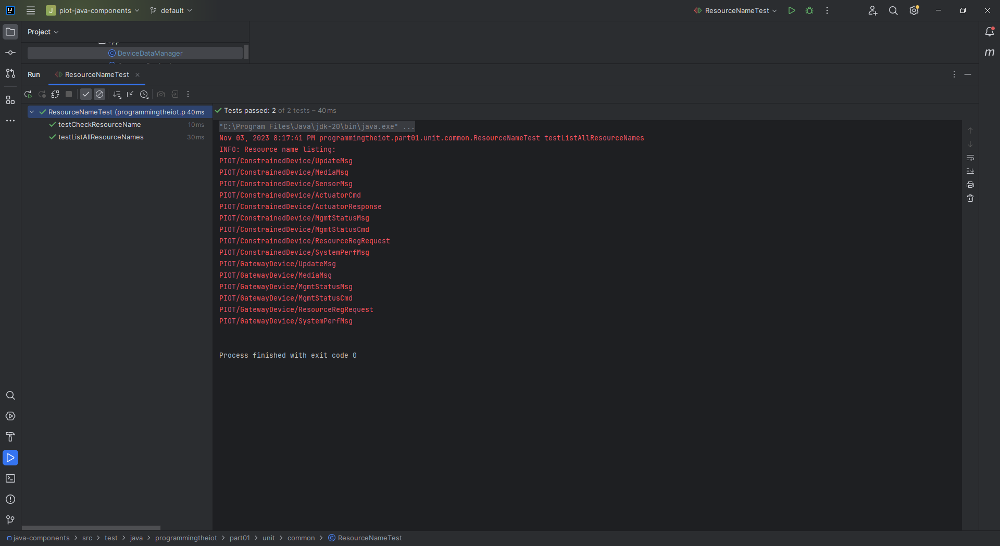

# Gateway Device Application (Connected Devices)

## Lab Module 10

Be sure to implement all the PIOT-GDA-* issues (requirements) listed at [PIOT-INF-10-001 - Lab Module 10](https://github.com/orgs/programming-the-iot/projects/1#column-10488510).

### Description

NOTE: Include two full paragraphs describing your implementation approach by answering the questions listed below.

What does your updated implementation do?

The GDA now supports edge messaging using MQTT for handling various messaging scenarios between the GDA and CDA. It leverages both the Mosquitto MQTT broker and the CoAP server based on the Californium framework, enabling flexible and diverse communication patterns. This facilitates data exchange through MQTT or CoAP, catering to the preferences and requirements of different devices and systems. Additionally, the GDA has enhanced functionalities, including tracking trending values to preemptively trigger actuation events, monitoring the total number of threshold crossings, and prompting the CDA to adjust floor/ceiling values when the threshold crossings exceed a specified count ('n'). It also actively monitors threshold crossings and triggers adjustments if the threshold is exceeded.

How does your updated implementation work?

The GDA serves as an interface between the CDA and local devices, receiving data through the Mosquitto MQTT broker or the CoAP server. It utilizes JSON serialization and deserialization to process data wrappers efficiently. Moreover, the GDA can publish and subscribe to MQTT topics, handle CoAP requests and responses, and perform edge messaging tasks such as tracking trends and threshold crossings. This dual-protocol capability ensures seamless communication with the CDA while supporting various edge messaging functionalities. Furthermore, the GDA persists important data in Redis, ensuring swift access and reducing external data requests in edge computing scenarios. This local data storage feature optimizes the GDA's performance by efficiently managing data received through MQTT or CoAP. Overall, the updated GDA implementation not only enables versatile communication between the GDA and CDA using MQTT and CoAP but also incorporates edge messaging functionalities to track trends, monitor threshold crossings, and prompt necessary adjustments, providing a comprehensive solution for efficient edge-tier performance.

### Code Repository and Branch

NOTE: Be sure to include the branch (e.g. https://github.com/programming-the-iot/python-components/tree/alpha001).

URL: https://github.com/lcbathtissue/java-components

### UML Design Diagram(s)

NOTE: Include one or more UML designs representing your solution. It's expected each
diagram you provide will look similar to, but not the same as, its counterpart in the
book [Programming the IoT](https://learning.oreilly.com/library/view/programming-the-internet/9781492081401/).

### Unit Tests Executed

NOTE: TA's will execute your unit tests. You only need to list each test case below
(e.g. ConfigUtilTest, DataUtilTest, etc). Be sure to include all previous tests, too,
since you need to ensure you haven't introduced regressions.

- ActuatorDataTest

- BaseIotDataTest

- ConfigUtilTest

- DataUtilTest

- ResourceNameTest

- SensorDataTest

- SimpleCertManagementUtilTest

- SystemCpuUtilTaskTest

- SystemMemUtilTaskTest

- SystemPerformanceDataTest

### Integration Tests Executed

NOTE: TA's will execute most of your integration tests using their own environment, with
some exceptions (such as your cloud connectivity tests). In such cases, they'll review
your code to ensure it's correct. As for the tests you execute, you only need to list each
test case below (e.g. SensorSimAdapterManagerTest, DeviceDataManagerTest, etc.)

- CloudClientConnectorTest

- CoapClientConnectorTest

- CoapClientPerformanceTest

- CoapClientToServerConnectorTest

- CoapServerGatewayTest

- DataIntegrationTest

- DeviceDataManagerNoCommsTest

- DeviceDataManagerWithCommsTest

- GatewayDeviceAppTest

- MqttClientConnectorTest

- MqttClientControlPacketTest

- MqttClientPerformanceTest

- PersistenceClientAdapterTest

- SmtpClientConnectorTest

- SystemPerformanceManagerTest

EOF.
